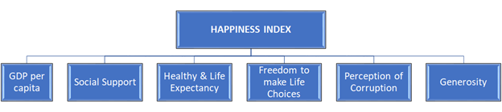

<html>


<h3>Framing the Problem:</h3>
<br>
<h4>1. 	Problem recognition:</h4>
<p>
The World Happiness report is one of the planet’s most comprehensive reference points to indicate life satisfaction and happiness. 

One might ask why such a report is important? What is its relevance?

Governments across nations are constantly striving towards growing their economies. One such measure of economic growth is GDP. As these nations strive towards achieving their financial goals, it is important to also assess the happiness of their citizens.  Happiness is one interesting metric to estimate the life satisfaction of citizens. 

This index of happiness may seem like an intangible concept at first, but it has a direct impact on national and international social sciences as well as world economics. These elements form a strong foundation for the functioning of a national society. Hence it is crucial to understand the trends, patterns, and developments in the levels of happiness across the citizens of different nations. If one were to create a system thinking approach: It is the levels of happiness or dissatisfaction among citizens that start the ball rolling on factors that may lead to the development or demise of countries. Our team believes that as data analysts, it is our responsibility to shed light and provide analysis on a topic with potentially global ramifications.

</p>
<br>

<h4>2. Review of Previous findings:</h4>
<p>
In order to understand the importance of satisfaction and happiness, the United Nations held a meeting to discuss this subject under the bracket “Well-Being and Happiness: Defining a New Economic Paradigm.”
 
The impact of this meeting further aided in the creation of the World Happiness Report, which has been published annually since 2012. There is a sound methodology around creating this report, which spans across 150+ nations annually. It involves a local presence where a sample of at least 1000 participants is taken from each country, spanning across both urban and rural landscapes to incorporate all sections of the society to involve the multiple variations present within a nation’s social hierarchies. These surveys are conducted with the same mindset across 150+ countries, where their national happiness index is marked by their standing on the Cantril Ladder, based on the surveys of the Gallup poll data.

 
Our initial findings upon evaluating the data revealed a statistically suggestive relationship between a country’s GDP and their happiness index, suggesting that richer countries with a higher level of GDP tend to have better access to the other factors such as better social support, better health facilities, more societal harmony and are overall happier nations. One might argue that higher GDP may facilitate social and environmental progress which can lead to high levels of satisfaction among nations' citizens. 

This also raises the question that is GDP the only driving factor towards a nation's happiness. If the influence of GDP is isolated, then which other social and cultural factors contribute towards the happiness quotient of the nation. 

To evaluate these underlying tendencies- we intend to draw a deeper insight into social and cultural trends within nations of different economic standings where the categorization is based on the GDP.

 
This leads us to evaluate the following hypotheses:

</p>
<h4>Hypotheses</h4>

1.  Is GDP the dominant factor that contributes towards happiness score across all economic categories
2.  Does health and well being contribute towards happiness score across all economic categories


```{r setup 1, include=FALSE}
knitr::opts_chunk$set(echo = TRUE)


library(tidyverse)
library(dplyr)
library(viridis) #For using color palette
library("broom")

 
custom.col <- c("#81BEF7", "#0B2161","#0080FF","#58ACFA", "#08298A",  "#0B243B")
#shades of blue
custom.blue <- c(
"#D4E6F1",
"#D6EAF8",
"#AED6F1",
"#85C1E9",
"#5DADE2",
"#3498DB",
"#2E86C1",
"#2874A6",
"#21618C",
"#1B4F72")


#Darker shades of blue colors
custom.dark.blue <- c(
"#3498DB",
"#2E86C1",
"#2874A6",
"#21618C",
"#1B4F72")

custom.tri.dark.blue <- c("#1B4F72","#3498DB","#2874A6")

custom.tri.blue <- c("#AED6F1","#1B4F72","#5DADE2")

```


<h3>Solving the Problem:<h3>
<br>
<h4>1  Variable Selection:</h4>

<p>The data for this analysis is based on the World Happiness Report. For this project, our team is considering the historical data of all annually published happiness reports from 2015 till 2020. We are taking into consideration the following social and cultural factors:
</p>

<center>

</center>


<h4>2.1 	Data collection:</h4>

The original data has been collected by Gallup Poll data and published in the World Happiness Report. Our dataset source for this project was available on Kaggle: https://www.kaggle.com/mathurinache/world-happiness-report
https://www.kaggle.com/unsdsn/world-happiness

 

```{r data collection 2.1, results='hide', message=F, warning=F}

#loading csv files
df_report_2015=read_csv("dataset/2015.csv")
df_report_2016=read_csv("dataset/2016.csv")
df_report_2017=read_csv("dataset/2017.csv")
df_report_2018=read_csv("dataset/2018.csv")
df_report_2019=read_csv("dataset/2019.csv")
df_report_2020=read_csv("dataset/2020.csv")

```
</br>
<i>Data are adjusted using Gallup weights to make the estimates representative and comparable across countries. Thus the values cannot be considered as an absolute values for the features used in the analysis.</i>


<h4>2.2 Data Wrangling</h4>


As the data is spread across multiple sheet, one for each year since 2015. To enforce consistency column names were renamed.


```{r data wrangling 2.2.1,results='hide', message=F, warning=F}

#Vector with column names for consistency in column names across all dataframes
vec_new_col_names<- c("country","region","happiness_score","gdp_per_capita","social_support","health_life_expectancy","freedom_to_life_choices","perception_of_corruption","generosity","dystopia")


#Renaming column names for first 10 columns
colnames(df_report_2015)[1:10] <- vec_new_col_names
colnames(df_report_2016)[1:10] <- vec_new_col_names
colnames(df_report_2017)[1:10] <- vec_new_col_names
colnames(df_report_2018)[1:10] <- vec_new_col_names
colnames(df_report_2019)[1:10] <- vec_new_col_names
colnames(df_report_2020)[1:10] <- vec_new_col_names

```


Data across the sheets were aggregated into one dataframe labelled as 'report'. Happiness scores across 5 years with respect to countries are aggregatd into the dataframe 'df_happiness_score'. 


```{r data wrangling 2.2.2,results='hide', message=F, warning=F}


#list of dataframes
lst_report=list(df_report_2015,
df_report_2016,
df_report_2017,
df_report_2018,
df_report_2019,
df_report_2020)


#initializing year variable
year_val=2015

#Aggregating data from all dataframes into one dataframe
for(i in seq_along(lst_report)){
print(i)
  #selecting first 10 columns
  df<-lst_report[[i]][1:9]
  
  #adding year column to the dataframe
  df<-df %>% 
    mutate(year=year_val)
  
  #incrementing year values for next dataframe
  year_val=year_val+1
 
  #for first dataframe copying 2015's dataframe directly to report dataframe
  if(i==1){
    report <- df  
  } 
  else{
  #binding rows for rest of the dataframes
  report<- rbind(report, df)
  }
}


#All the countries in the dataframe
countries<- distinct(df_report_2015["country"])


#Merging scores acoss all sheets using inner join
for(i in seq_along(lst_report)){

  #loading df_happiness_score for year 2015
  if(i==1){
  df_happiness_score<-inner_join(countries[,c("country")],
                   lst_report[[1]][,c("country","happiness_score")], #merging only happiness scores
                   by = "country") #joining on country
  }  
  #adding columns for rest of the dataframe (2016-2020)
  else{  
  df_happiness_score<-inner_join(df_happiness_score,
                   lst_report[[i]][,c("country","happiness_score")],
                   by = "country")
  }
}

#We have all the scores from 2015 to 2020
#Renaming merged columns
colnames(df_happiness_score)<-c("country","2015","2016","2017","2018","2019","2020")

```


On aggregation, perception_of_corruption had character as the datatype. The data type of the column is changed back to numerical.Aggregated data is checked for missing values.

NA's are induced into the column due to the change in data type. The average value for 2017 and 2019 is used to filling the missing values for the specific country. 

Region label 'Commonwealth of Independent States' is changed to 'Former USSR' for better representation of the countries.


```{r data wrangling 2.2.3,results='hide', message=F, warning=F}

#checking for missing values
colnames(report)[colSums(is.na(report)) > 0]

#checking datatype for perception of corruption 
class(report$perception_of_corruption)
#Perception of corruption has been aggrgated as a categorical variable instead of numerical

#changing data type to numerical
report$perception_of_corruption = as.numeric(as.character(report$perception_of_corruption))

#Checking for NA values induced by last operation
sum(is.na(report$perception_of_corruption))

#Taking the average value of the two years 2017 and 2019 to fill in NA values
corruption_UAE_18<- report %>% 
  filter(country=="United Arab Emirates" & (year==2017 | year==2019)) %>% 
  summarise( mean(perception_of_corruption))


#Checking for NA values 
 report %>% 
   filter(is.na(perception_of_corruption))

#updating dataframe
report$perception_of_corruption[report$country=="United Arab Emirates"& report$year==2018]=corruption_UAE_18[[1]]

#Changing region label form Commonwealth of Independent States to Former USSR for better representation of the data 
df_report_2020$region[df_report_2020$region=="Commonwealth of Independent States"]="Former USSR"

```

<h3>3. 	Data Analysis:</h3>

<h4>3.1 Exploratory Data Analysis</h4>
<br>

```{r EDA 3.1.1, echo=T, message=F, warning=F}
#Checking the distinct regions

pie(table(df_report_2020$region), main = "Regions", col = custom.blue)  

```

The pie chart displays the regional distribution of nations within the dataset.

Upon classifying the dataset in 10 sub regions, we find:
-The most number of countries in the dataset belong to the Sub-Saharan Africa region.
-The fewest number of countries belong to the North America and Australia/ New Zealand region


```{r EDA 3.1.2, echo=T, message=F, warning=F}

#Happiness across different region  
df_report_2020 %>% 
  group_by(region) %>% 
  ggplot(., aes(happiness_score))+
  geom_density(color="#1B4F72")+
  facet_wrap(~region, nrow = 4)+
  scale_color_manual(values = custom.blue)+
  labs(title="Regional Distribution of Happiness Index \n", x="Happiness Scores")

```


Most of the countries show a trend similar to their regional counterparts: owing to cultural similarities, similar existing trends, seemingly similar social structures among the population. Due to these factors, we don’t find a highly significant variation in the regional happiness index patterns.
 
Western Europe shows the most stable and steady distribution: with the majority of its constituent countries in the high satisfaction and happiness range.
 
The region of North America, Australia, and New Zealand displays a bimodal distribution: This is due to the fact that these 2 regions have been grouped together since both these regional sub-groups each comprise of just 2 observations(countries) thereby justifying the highly steep variation and the twin peak visualization.


```{r EDA 3.1.3, echo=T, message=F, warning=F}

require(gridExtra)


#Scatter plot for top 5 countries
plot1 <- df_happiness_score %>% 
  pivot_longer(.,c("2015","2016","2017","2018","2019","2020"),  #pivoting to aggregate years
               "year") %>% 
  #filter(Country=="Switzerland") %>% 
  filter(value>7.5 ) %>%    #selecting happiest countries
  ggplot(., aes(value,year, color=country))+
  geom_point(size=2)+
  scale_color_manual(values = custom.dark.blue)+
  labs(title="Top 5 Happiest Countries\n")

#Scatter plot fot bottom 5 countries
plot2 <- df_happiness_score %>% 
  pivot_longer(.,c("2015","2016","2017","2018","2019","2020"),
               "year") %>% 
  #filter(Country=="Afghanistan") %>% 
  filter(value<3.3) %>%  #selecting the least happy countries
  
  ggplot(., aes(value,year, color=country))+
  geom_point(size=2)+
  scale_color_manual(values = custom.dark.blue)+
  labs(title="5 Unhappiest Countries\n")


#plotting grid
grid.arrange(plot1, plot2, ncol=2)


```

5 happiest countries: Although Finland has a marginal growth in GDP since 2015, it shows steady growth in happiness scores over the years becoming the happiest country in 2020. This emphasizes that other socio-economic factors contributed to this growth. 

5 unhappiest countries: These countries have a happiness score less than 3.3 over the years. Afghanistan shows the strongest decline in the happiness score over the years.


```{r EDA 3.1.4, echo=T, message=F, warning=F}

#max happiness score per region
df_report_2020 %>% 
  group_by(region) %>% 
  summarise(health_max=max(health_life_expectancy)) %>% 
  arrange(., health_max) %>% 
  ggplot(., aes(y=reorder(region,-health_max,sum), x=health_max, fill=region))+
  geom_col()+
  scale_fill_manual(values = custom.blue)+
  labs(title="Region wise health and life expectancy\n",
       x= "Health and Life Expectancy",
       y="Regions")

```

The above visualization showcases the region's wise health and life expectancy.
South East Asia and East Asia have the highest level of health and life expectancy whereas Sub- Sahara African region has the lowest level of health and life expectancy.


```{r EDA 3.1.5, echo=T, message=F, warning=F}


#Scatter plot for perception of corruption based on 2020 report
df_report_2020 %>% 
  ggplot(., aes(perception_of_corruption,happiness_score))+
  geom_point( aes( color=region),size=2)+
  geom_smooth(method = "lm", color="#1B4F72")+
  scale_fill_manual(values = custom.blue)+
  scale_color_manual(values = custom.blue)+
  labs(title="Perception of Corruption vs Happiness Score\n",
       x= "Perception of Corruption",
       y="Happiness Score")

```

The scatter plot shows countries segmented by their sub-regions to represent their happiness score against the perception of corruption in their public sector.
 
We notice the best fit line progressing upwards due to the anomaly that exists due to certain countries with the very high happiness score, who also exhibit a higher level of perceived corruption.
 
While most of the countries in the low to moderate happiness index show a lower range of perceived corruption, some of the happiest countries have a higher perception of corruption in their government sector. This observation of perceived corruption is analyzed further in the following sections of this report.


```{r EDA 3.1.6, echo=T, message=F, warning=F}

#GDP vs Happiness
df_report_2020 %>% 
  ggplot(., aes(gdp_per_capita,happiness_score))+
  geom_point(aes(color=region))+
  geom_smooth(method = "lm",color="#1B4F72")+
  scale_color_manual(values = custom.blue)+
  labs(title="GDP per Capita vs Happiness Score\n",
       x= "GDP per Capita",
       y="Happiness Score")


```

The scatter plot and the best fit line demonstrates the happiness score of regionally segregated nations vs their GDP per capita. The best fit line helps us draw the inference that countries with higher GDP / richer countries tend to be happier. We can draw an initial inference that due to higher GDP, these nations have access to higher Social support standards and welfare measures for its citizens and a higher level of freedom to make choices which might account for citizens to be more satisfied and overall happier with their overall quality of social and economic environment.


<br><br><br>

<h4>3.2 Clusters</h4>


Our research uncovered the fact that across 150+ countries, there are several political, economic, societal and geographic factors that contribute towards a lot of variation in the happiness index among nations. It is clear that the GDP or the ‘richness’ of a country is a good yardstick that often co-relates to a country’s development. But what are the factors along with the GDP that statistically contribute towards the happiness index of a country?
 
In order to understand these impacting factors, our team clubbed all the 150+ countries across 5 years data into 3 clusters based on GDP. The High, moderate and Low GDP clusters of countries help us further analyze these trends and patterns that exist among nations.


```{r 3.2.1 cluster analysis, echo=T, message=F, warning=F}

#creating three clusters to bifurcate all countries into three set based on their GDP
gdp_clusters <-kmeans(report[4], 3)

#Adding a column cluster for representing the cluster number for that dataset
report$cluster<- gdp_clusters$cluster


#summarizing the output of the clusters on happiness score and GDP per captia
gdp_cluster_summary<-report %>% 
  group_by(cluster) %>% 
  summarise(count=n(),max(happiness_score), min(happiness_score), max_gdp=max(gdp_per_capita), min(gdp_per_capita))


#For loop to label to create a categorical label for the clusters
#running the loop for each cluster
for(i in 1:nrow(gdp_cluster_summary)){
  
  #selecting the max gdp value per cluster
  val=gdp_cluster_summary %>% 
    filter(cluster==i) %>% 
    select(max_gdp)
  
  
  #Checking if the selected values is the max gdp for any cluster
   if(val==max(gdp_cluster_summary$max_gdp)){
     
     #Adding a new columns for the categorical value
      report$gdp_category[report$cluster==i]<- "High GDP"
  
   }
  #Checking if the GDP value is the lowest among all clusters
  else if(val==min(gdp_cluster_summary$max_gdp)){
  
      report$gdp_category[report$cluster==i]<- "Low GDP"
  
    }
   else{
    
      report$gdp_category[report$cluster==i]<- "Moderate GDP"
      }
}


```


CLUSTER: Happiness vs Social Support
 
HIGH GDP Cluster:
 
The scatter-plot results show that well-funded countries with a higher GDP per capita have a significantly higher level of happiness influenced by their levels of social support. With majority of the high GDP nations exhibiting results skewed towards a high social support index while exhibiting high scores on the happiness index. Suggesting a general trend of a highly satisfied, happier population.
 
LOW GDP Cluster:
 
Majority of the low GDP nations exhibiting results skewed towards a low support index while exhibiting much lower levels of happiness. Suggesting a general trend of an unsatisfied, unhappier population.
 
Moderate GDP Cluster:

Majority of the moderate GDP nations exhibiting results spread across a wider range that exhibit a wide range of happiness indexes, but the social support levels are skewed towards the mid-high level. Suggesting a general trend of a highly diverse population with a high degree of variability with respect to social support and happiness. We can surmise that this trend is due to high diversity in individual country laws where some are highly committed or uncommitted towards government based social support despite being a moderate GDP country. Suggesting a highly variant group of observations with individualistically diverse social support norms.


```{r 3.2.2 cluster analysis, echo=T, message=F, warning=F}


report %>% 
  ggplot(., aes(social_support, happiness_score, color=gdp_category))+
  geom_point()+
  geom_smooth(method="lm")+
  facet_wrap(~gdp_category)+
  scale_color_manual(values = custom.tri.dark.blue)


```

CLUSTER: Happiness vs Generosity:
 
The scatter plots showcase the individualistic trends observed among the 3 clustered national groups with respect to their Happiness Index vs Generosity levels.
 
Our analysis pointed out that contrary to the expected inference that ‘High GDP countries might tend to showcase more generosity’, we find the highest levels of generosity among the low GDP cluster, whereas the highest number of generous countries fall under the moderate GDP cluster.

```{r 3.2.3 cluster analysis, echo=T, message=F, warning=F}


report %>% 
  ggplot(., aes(generosity, happiness_score, color=gdp_category))+
  geom_point()+
  geom_smooth(method="lm")+
  facet_wrap(~gdp_category)+
  scale_color_manual(values = custom.tri.dark.blue)


```

 
CLUSTER: Happiness vs Freedom to make life choices
 
These plots highlight the common element for most nations across all 3 GDP cluster groups, highlighting a positive inference where there is an even spread of freedom to make life choices across all 3 clusters. While the range of the happiness score is higher in high GDP countries, followed by the moderate and then the low GDP cluster, nearly all observations have a similar distribution spread with respect to freedom to make life choice suggesting: freedom to make life choices is not governed by the GDP cluster, instead it may heavily rely on a nation’s national culture and beliefs.

```{r 3.2.4 cluster analysis, echo=T, message=F, warning=F}

report %>% 
  ggplot(., aes(freedom_to_life_choices, happiness_score, color=gdp_category))+
  geom_point()+
  geom_smooth(method="lm")+
  facet_wrap(~gdp_category)+
  scale_color_manual(values = custom.tri.dark.blue)

```


CLUSTER: Happiness vs Perception of Corruption
 
These scatter plots showcase the individualistic trends observed among the 3 clustered national groups with respect to their Happiness Index vs perception of corruption.
 
The initial plot discussed earlier showed the best fit line suggesting that countries with a higher perception of corruption tend to be happier and more satisfied .However the subgrouping clustering revealed that this anomaly was only due to the High GDP cluster, where Western European and Nordic countries in this cluster demonstrate the highest levels of happiness but also have a characteristic of higher perception of corruption in their public sector.
 
The cluster of low and moderate GDP both showcase much lesser perceptions of corruption in comparison to the high GDP cluster. The nations in the moderate cluster tend to show the relative lowest range of spread among the perception of corruption while exhibiting a range of low to highly satisfied nations.


```{r 3.2.5 cluster analysis, echo=T, message=F, warning=F}

 report %>%
  ggplot(., aes(perception_of_corruption, happiness_score, color=gdp_category))+
  geom_point()+
  geom_smooth(method="lm")+
  facet_wrap(~gdp_category)+
  scale_color_manual(values = custom.tri.dark.blue)

```
 


<h3>Outlier Detection</h3>

As we are evaluating the variation in features across three GDP categories, we are looking for outliers within these categories. We have used boxplots to detect outliers. Once outliers are detected, they are removed from the dataset and a histogram is plotted to show the change in distribution for the feature.


```{r Outliers 4.1, echo=T, message=F, warning=F}

require(gridExtra)


#Evaluating outliers for health and life expectancy

social_support_plot1 <- report %>% 
  ggplot(., aes(x=social_support, fill=gdp_category))+
  geom_boxplot()+
  scale_fill_manual(values = custom.tri.blue)


report <- report %>% 
  filter((gdp_category=="Moderate GDP" & social_support>0.3) |
(gdp_category=="Low GDP" & social_support!=0) |
(gdp_category=="High GDP" & social_support>0.7))


social_support_plot2 <- report %>% 
  ggplot(., aes(x=social_support, fill=gdp_category))+
  geom_histogram()+
  scale_fill_manual(values = custom.tri.blue)


grid.arrange(social_support_plot1, social_support_plot2, nrow=2)

```


The Box plot for the social support variable revealed the following information :
 
Moderate GDP : 75% of the observations lie between 0.3 and 1.6 with a median value of 1.1 with 3 outliers.
LOW GDP : 75% of the observations lie between 0.1 and 1.45 with a median value of 0.9 with 1 outlier.
High GDP: 75% of the observations lie between 0.7 and 1.6 with a median value of 1.2 with 3 outliers. nations.

Low GDP observations skew the distribution towards right.


```{r Outliers 4.2, echo=T, message=F, warning=F}

#Evaluating outliers for health and life expectancy
health_life_plot1<-report %>% 
  ggplot(., aes(x=health_life_expectancy, fill=gdp_category))+
  geom_boxplot()+
  scale_fill_manual(values = custom.tri.blue)

report <- report %>% 
  filter((gdp_category=="Moderate GDP" & health_life_expectancy>0.27) |
(gdp_category=="Low GDP" & health_life_expectancy<0.5) |
(gdp_category=="High GDP" & health_life_expectancy>0.45))


health_life_plot2<-report %>% 
  ggplot(., aes(x=health_life_expectancy, fill=gdp_category))+
  geom_histogram()+
  scale_fill_manual(values = custom.tri.blue)


grid.arrange(health_life_plot1, health_life_plot2, nrow=2)


```

 
The Box plot for the social health and life expectancy variable revealed the following information :
Moderate GDP : 75% of the observations lie between 0.2 and 1 with a median value of 0.7 with 8 outliers.
LOW GDP: 75% of the observations lie between 0. and 0.75 with a median value of 0.4 with 2 outliers.
High GDP: 75% of the observations lie between 0.5 and 1.1 with a median value of 0.8 with 3 outliers.

All outliers have been addressed to reveal a new range of observations for the health and life expectancy variable.


```{r outlier 2.2}

freedom_plot1<-report %>% 
  ggplot(., aes(x=freedom_to_life_choices, fill=gdp_category))+
  geom_boxplot()+
  scale_fill_manual(values = custom.tri.blue)

report <- report %>% 
  filter((gdp_category=="Moderate GDP" & freedom_to_life_choices>=0) |
(gdp_category=="Low GDP" & freedom_to_life_choices>=0) |
(gdp_category=="High GDP" & freedom_to_life_choices>0.14))

freedom_plot2<-report %>% 
  ggplot(., aes(x=freedom_to_life_choices, fill=gdp_category))+
  geom_histogram()+
  scale_fill_manual(values = custom.tri.blue)

grid.arrange(freedom_plot1, freedom_plot2, nrow=2)

```

 
The Box plot for the freedom to make life choices variable revealed the following information :
Moderate GDP : 75% of the observations lie between 0. and 0.75 with a median value of 0.425 with no outliers.
LOW GDP: 75% of the observations lie between 0. and 0.7 with a median value of 0.375 with no outliers.
High GDP: 75% of the observations lie between 0.125 and 0.675 with a median value of 0.52 with 3 outliers.


```{r Outliers 4.3, echo=T, message=F, warning=F}


corruption_plot1<-report %>% 
  ggplot(., aes(x=perception_of_corruption, fill=gdp_category))+
  geom_boxplot()+
  scale_fill_manual(values = custom.tri.blue)

report <- report %>% 
  filter((gdp_category=="Moderate GDP" & perception_of_corruption<0.22) |
(gdp_category=="Low GDP" & perception_of_corruption<0.22) |
(gdp_category=="High GDP" & perception_of_corruption>=0))


corruption_plot2<-report %>% 
  ggplot(., aes(x=perception_of_corruption, fill=gdp_category))+
  geom_histogram()+
  scale_fill_manual(values = custom.tri.blue)

grid.arrange(corruption_plot1, corruption_plot2, nrow=2)

```

Moderate GDP : 75% of the observations lie between 0 and 0.22 with a median value of 0.075 with 8 outliers.
LOW GDP: 75% of the observations lie between 0 and 0.22 with a median value of 0.4 with 10 outliers.
High GDP: 75% of the observations lie between 0.5 and 0.28 with a median value of 0.15 with 0 outliers.
All outliers have been addressed to reveal a new range of observations for the perception of corruption variable.


```{r Outliers 4.4, echo=T, message=F, warning=F}


gdp_plot1<-report %>% 
  ggplot(., aes(x=gdp_per_capita, fill=gdp_category))+
  geom_boxplot()+
  scale_fill_manual(values = custom.tri.blue)


report <- report %>% 
  filter((gdp_category=="Moderate GDP" & gdp_per_capita>0) |
(gdp_category=="Low GDP" & gdp_per_capita>0) |
(gdp_category=="High GDP" & gdp_per_capita<1.6))


gdp_plot2<-report %>% 
  ggplot(., aes(x=gdp_per_capita, fill=gdp_category))+
  geom_histogram()+
  scale_fill_manual(values = custom.tri.blue)


grid.arrange(gdp_plot1, gdp_plot2, nrow=2)


```

Moderate GDP : 75% of the observations lie between 0.6 and 1.125 with a median value of 0.9 with no outliers nations.
LOW GDP: 75% of the observations lie between 0 and 0.6 with a median value of 0.3 with no outlier nations.
High GDP: 75% of the observations lie between 1.1 and 1.6 with a median value of 1.3 with 5 outlier nations.


<h3>Hypothesis</h3>


<h3>Linear Model</h3>

To evaluate our hypothesis we created three statistically significant models, one for each GDP category. Based on these models we will check which independent variables statistically explain the variation in the happiness scores for their respective categories.

<i>As mentioned earlier, data is adjusted based on Gallup Weights and thus prediction drawn from the model may be unreliable. We will use the model to only test our hypothesis.</i>


<br>
<h4>Modelling Mechanics</h4>

The following function takes three inputs: Dataframe, list of categories, and list of features. The function filters the dataset based on each GDP category and generates linear models unless it finds a good model. 
As we are evaluating dependent variables, a good model is gauged by p-values less than 0.05 for each independent feature. 

Changes in R-square, F-statistic, Average error are recorded and summarized for each model. 

The function prints the summarized model statistics and coefficient for the best model found for the cartegory. The function also plots the residuals for the best model in each category.

```{r linear models 5.1, message=F, warning=F}


linear_model<-function(df,filter_criteria, features){

  vec_residual_plot=vector(length = 3)
  

    
  for(criteria in seq_along(filter_criteria)){
    
    print(filter_criteria[criteria])
    cat("\n")


    #Creating an empty dataframe for summarizing model informations
    model_summary <- data.frame(matrix(ncol = 4, nrow = 0))
    model_run_summary_col <- c("model no.", "R-squared", "F Statistic", "Average Error")
    colnames(model_summary) <- model_run_summary_col
      
        
    #boolean
    good_model=FALSE
    
    model_feature<- features
    
    #initializing model counter to track number of models generated each category
    model_counter=1
    while(!good_model){
      
      form="happiness_score ~"
    for(feat in seq_along(model_feature)){  
      if(feat==1){
        form=paste(form,model_feature[feat])
      }
      else{
          form=paste(form,model_feature[feat],sep = " + ")
      }
    
    }
      
      model<-df %>% 
      filter(gdp_category==filter_criteria[criteria]) %>% 
      lm(data=., formula = form)
      #glm(data=., formula = form,family = binomial(link = "logit"))
         
    tbl_model<- broom::tidy(model) #convering the model into tiddle

    p_val<-tbl_model$p.value  #extracting p-values
    
    
   avg_error<-broom::augment(model) %>%
   summarise(avg_error = mean(abs(happiness_score - .fitted)))
    
   
   fstat_p_val<-pf(summary(model)$fstatistic[1],summary(model)$fstatistic[2],summary(model)$fstatistic[3],lower.tail=FALSE) 
    
  #summarizing models   
   model_summary= rbind(model_summary,
                         c(model_counter,
                           round(summary(model)$r.squared, digits = 2),
                            fstat_p_val[[1]],
                           round(avg_error[[1]], digits = 2)))
    
    
    
   #incrementing counter 
    model_counter=model_counter+1
    
    
      if(sum(p_val>0.05)==0)
    {
 
      good_model=TRUE #setting boolean to exit loop
      
      #resetting column names distorted due to rbind
      colnames(model_summary) <- model_run_summary_col

    
      print(model_summary)
      cat("\n")     
      cat("Statistically significant model coefficients:\n")
      print(round(model$coefficients, digits=3))   
      cat("\n")
      cat("\n")
      
      #adding residuals to vector for plotting distributions
      vec_residual_plot[[criteria]]=broom::augment(model) %>%
        select(.resid)
      
    }
    else{

      #vector to hold statistically insignificant features
      drop_vec<- vector(mode ="character", length=sum(p_val>0.05))
      drop_counter=1  #setting drop counter
      
    for(feat in seq_along(model_feature)){
      
      if(p_val[feat+1]>0.05){ #check if p-value is more than threshold:0.05

        #adding feature names to be dropped
        drop_vec[drop_counter]<-model_feature[feat]
        drop_counter=drop_counter+1 #incrementing counter
      }
        
    }
      #remove independent features with high p values
      model_feature<- model_feature[!model_feature %in%  drop_vec] 
      
    }
    }
      
  }
  
  #creating plots
  p1<-ggplot(vec_residual_plot[[1]], aes(.resid)) +
   geom_histogram(fill="#1B4F72")+
    labs(title = "High GDP")
  
  
  p2<-ggplot(vec_residual_plot[[2]], aes(.resid)) +
    geom_histogram(fill="#3498DB")+
    labs(title = "Moderate GDP")
  
  
  p3<-ggplot(vec_residual_plot[[3]], aes(.resid)) +
    geom_histogram(fill="#2874A6")+
    labs(title = "Low GDP")
  
  
  grid.arrange(p1,p2,p3, nrow=3)
  
  }
  
```


Passing the feature list, GDP categories and the dataframe to the linear_model function.


```{r linear models 5.2, message=F, warning=F}

#list of features
vec_features<-c("gdp_per_capita","social_support","generosity","perception_of_corruption","freedom_to_life_choices","health_life_expectancy")

#Defining GDP categories
category=c("High GDP", "Moderate GDP", "Low GDP")

#executing modelling function
linear_model(report, category, vec_features)

```


<h4>Output Analysis</h4>
F statistics for all three models is very low thus signifying significant models. The average error is very high for all three models considering happiness scores lie in the range of 2-8. The same is depicted on the residual histogram for each model.

Following are our learning from the linear models:

High GDP: Based on the model we can conclude the health and life expectancy is not statistically significant in explaining the variation in happiness score. Rich countries have a strong health infrastructure and thus citizens in these countries no longer account for health as a contributor to their happiness. 

The population in Nordic countries has access to a very high standard of welfare initiatives such as free education and healthcare. These countries are mostly homogeneous among their citizen population and mindset. These nations also have very strong social support mechanisms for their citizens such as an unemployment insurance fund where employees will pay an insurance premium per month and after due process may be entitled towards 2 years of salary in case of unforeseen unemployment.

Moderate GDP: Contrary to our hypothesis that GDP is a major influencer towards happiness score the same is not reflective for moderate GDP countries. GDP per capita was removed due to high p-values which makes it statistically insignificant to the model. Generosity is also not significant in explaining the changes in happiness score in moderate GDP countries.


Low GDP: Perception of corruption, generosity, and health and life expectancy are statistically insignificant in the model. Whereas GDP per capital is significant with a high coefficient. Low R-square also suggests that there are missing independent features that can explain the variation in happiness score in low GDP countries. 


<H3> Conclusion</h3>


1. GDP per capita has a strong influence on High and Low GDP countries but not on Moderate GDP countries. Thus we reject our first null hypothesis.
2. Health and life expectancy statistically influence happiness score only in Moderate GDP countries. Thus we reject our second null hypothesis as well.
3. Social Support and freedom to make life choices stand out as independent factors that influence happiness scores across all categories. Thus indicating that freedom and social support makes people happy irrespective of their economic status.


<h3> REFERENCES:</h3>
 
https://worldhappiness.report/ed/2020/cities-and-happiness-a-global-ranking-and-analysis/
https://www.trackinghappiness.com/happiness-index-2018/
https://ourworldindata.org/happiness-and-life-satisfaction
https://ourworldindata.org/happiness-and-life-satisfaction
https://www.nytimes.com/2020/03/20/world/europe/world-happiness-report.html
https://s3.amazonaws.com/happiness-report/2012/World_Happiness_Report_2012.pdf
https://blogs.sas.com/content/sascom/2020/08/28/analyzing-happiness-data-in-2020/
https://community.powerbi.com/t5/Data-Stories-Gallery/World-Happiness-Report-2020/td-p/1150694
https://www.forbes.com/sites/laurabegleybloom/2019/03/25/ranked-10-happiest-and-10-saddest-countries-in-the-world/?sh=5b59cf1e6374
https://www.cnbc.com/2020/01/09/are-danish-people-really-happy-nordic-work-life-balance-secrets.html


</html>